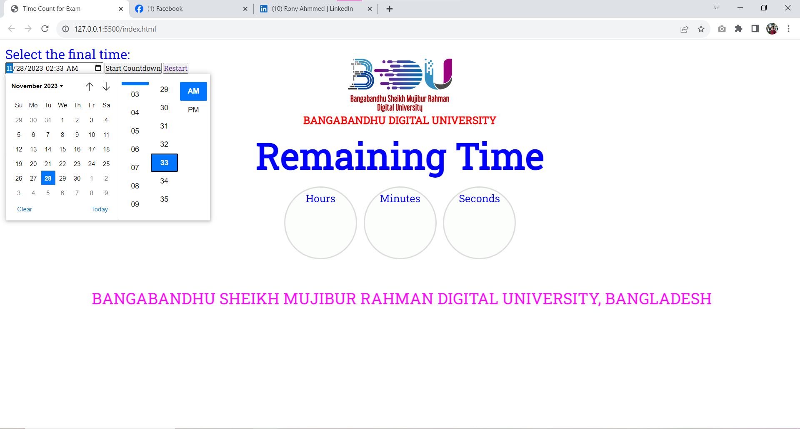

# TimeCounting

The Time Counting Repository is a project designed to manage and track time intervals leading up to a designated deletion point. This system allows users to record and monitor time spans with precision, providing a straightforward solution for tasks that require temporal constraints.

 
<a href="https://rony7s.github.io/time">View Project</a>

## Go to Link

## Select The final Time

## Feel the Time Counting

## After finish the Time

# Thank you
### Rony Ahmmed EdTech-BDU
#### E-mail: bdu.rony@gmail.com

